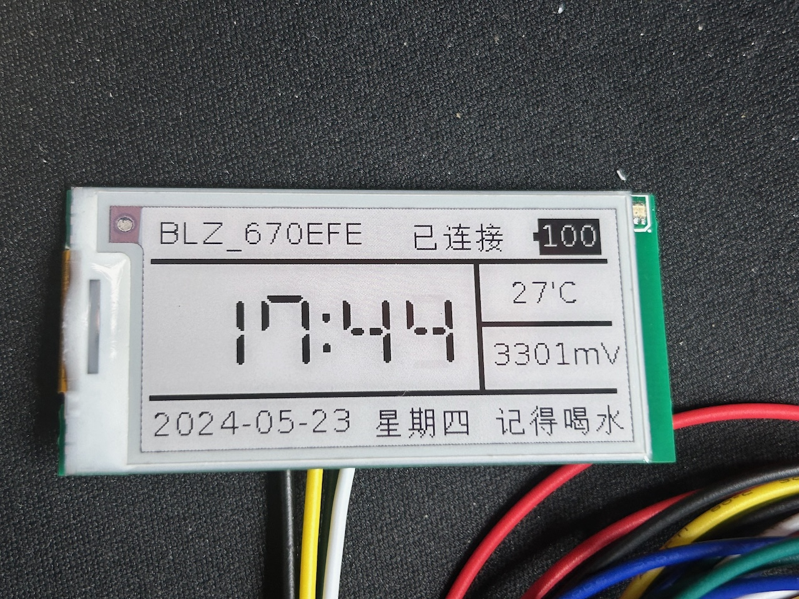
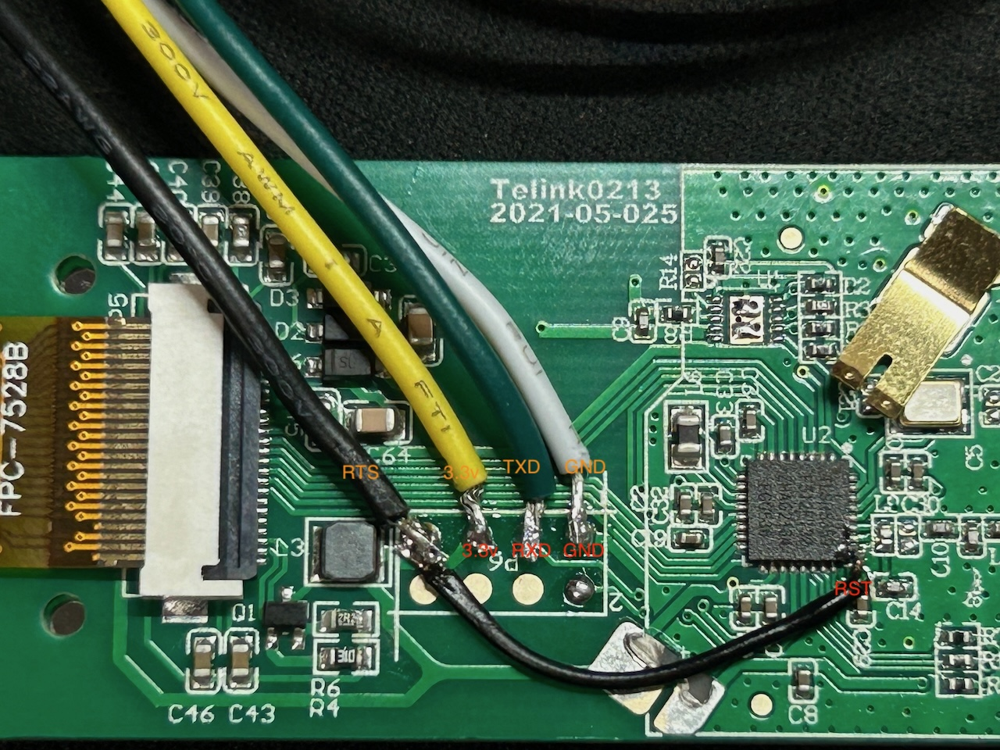
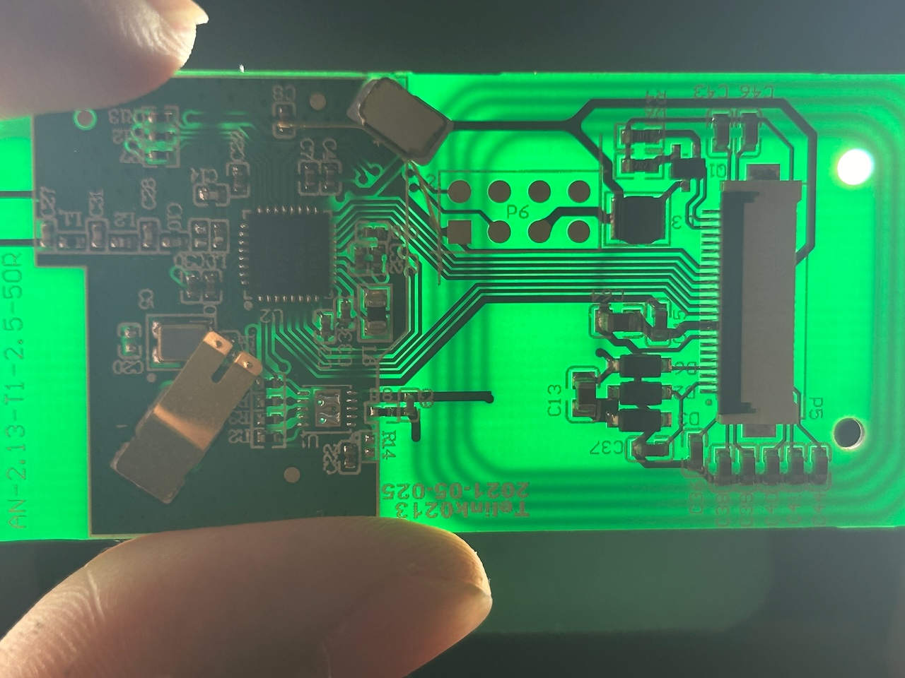

# Check the original readme from

- [atc1441/ATC_TLSR_Paper](https://github.com/atc1441/ATC_TLSR_Paper) the original repository.
- [reece15/stellar-L3N-etag](https://github.com/reece15/stellar-L3N-etag) the forked repository.

# What does this repo do?

- Updated the pin io for Blozi price tag(see `main.h`)
- Tested on Blozi BWR 2.13

# Flash guide

> USB-Serial(Orange) - PCB(Red)

- 3.3v
- GND
- TX - SWS
- RTS - RST

# Other

